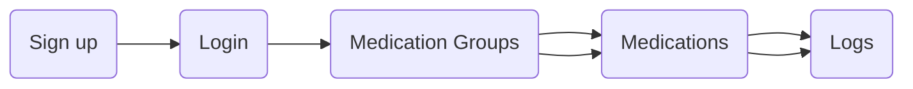

## Project Description ##
A basic __Medication Administration Record__ application written in JavaScript using `React Native`, a framework that enables JavaScript to run on `iOS` and `Android` natively, and `Google's Cloud Firestore`, a cloud-native NoSQL document storage for persisting data.

## Application Flow ##

1. Sign up - Create an account using your personal info
2. Login - Use the email address and password you provided
3. Medication Groups - Group of medications based on purpose (e.g. Allergies, Supplements, etc.)
4. Medications - Name of medication, dosage, frequency, and related notes (e.g. Benadryl, Vitamin C, Tylenol, etc.)
5. Logs - List of dates of medications that were taken