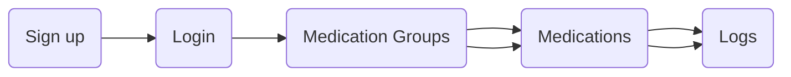

## Objective ##
Coming from web development, this project is an attempt to transfer my knowledge to and enhance my skills in mobile development.

## Project Description ##
A basic __Medication Administration Record__ application written in JavaScript using `React Native`, a framework that enables JavaScript to run on `iOS` and `Android` natively, and `Google's Cloud Firestore`, a cloud-native NoSQL document storage for persisting data.

Firestore project is needed in order for this project to run locally.

## Application Flow ##

1. _Sign up_ - Create an account using your personal info
2. _Login_ - Use the email address and password you provided
3. _Medication Groups_ - Group of medications based on purpose (e.g. Allergies, Supplements, etc.)
4. _Medications_ - Name of medication, dosage, frequency, and related notes (e.g. Benadryl, Vitamin C, Tylenol, etc.)
5. _Logs_ - List of dates of medications that were taken

## To do ##
* Unit tests
* End-to-end
